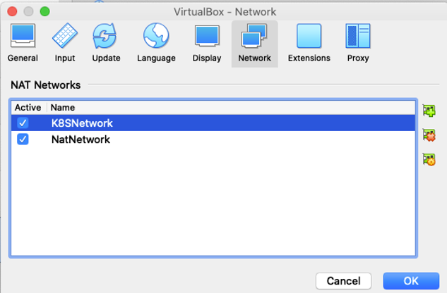
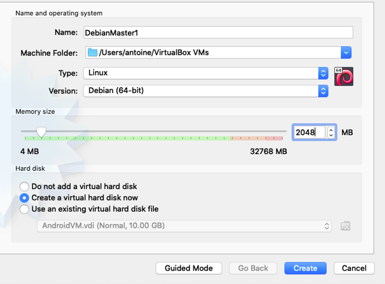
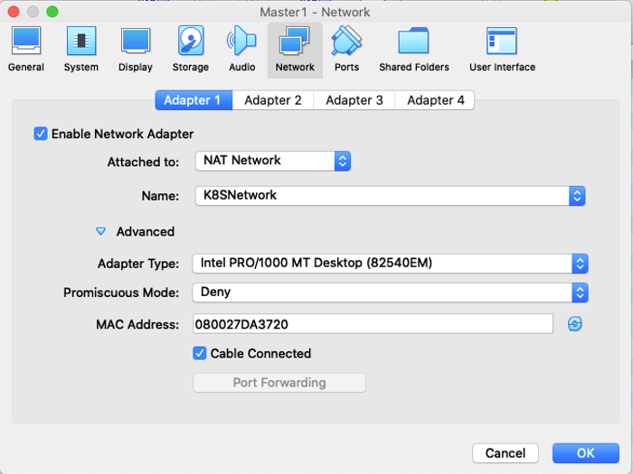
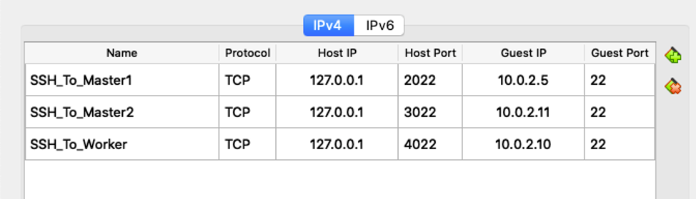
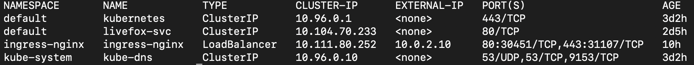
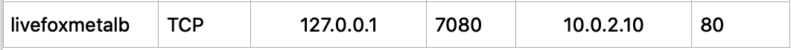

# Version with Virtual Machine

### Setup Local VMs K8s Cluster Multi-masters

First, you should create a NatNetwork for the cluster. In VirtualBox, go to Preferences >> Network >> create NatNetwork

You should have something like this:

You can change the name if you want, to do this just right click on your NatNetwork and on Properties.

Then Download Debian-iso: https://cdimage.debian.org/debian-cd/current/amd64/iso-dvd/

Now, create 3 VM in VirtualBox: Master1, Master2 and Worker.

#### Configurations Recommendations

- I recommend at least 2048MB of RAM for the Master 1, it should be nice for Master 2 but 1024 should do the trick and
for the worker 1024 should be enough.
- Two CPU cores for Master1 and Master2 and one for Worker.
- You can Install Master1 with Desktop for convenience, but it is not necessary and server type for Master2 and Worker
will be sufficient.
- For the storage it depends on your needs, I personally recommend 15GB,10GB and 10GB.
- Go to settings in each VM and change the network settings to:

- I advise to use the same password for the 3 users if you want to use ansible.

Now, for convenience you can do repeat this step on each VM.

As root,

    sudo adduser master1 sudo

Then, be Sure to have the config that follow in /etc/apt/sources.list

    deb http://deb.debian.org/debian buster main
    deb-src http://deb.debian.org/debian buster main

    deb http://security.debian.org/debian-security buster/updates main contrib
    deb-src http://security.debian.org/debian-security buster/updates main contrib

    deb http://deb.debian.org/debian buster-updates main
    deb-src http://deb.debian.org/debian buster-updates main

Go Back to virtual box preferences >> Network > rightclick k8sNetwork edit > Port Forwarding and you can setup something like
that to communicate with the host machine, there I have enable ssh for the 3 VM.

Then, you can ssh like this:

    ssh -p 2022 master1@127.0.0.1

### Install docker

If you manage to setup ansible do it with the script install_docker I gave you.

Else you can do it manually: https://docs.docker.com/engine/install/debian/

Here are the commands:

    sudo apt-get update
    sudo apt-get install \
      apt-transport-https \
      ca-certificates \
      curl \
      gnupg-agent \
      software-properties-common
    curl -fsSL https://download.docker.com/linux/debian/gpg | sudo apt-key add -
    sudo add-apt-repository \
      "deb [arch=amd64] https://download.docker.com/linux/debian \
      $(lsb_release -cs) \
      stable"
    sudo apt-get update
    sudo apt-get install docker-ce docker-ce-cli containerd.io

### Install kubernetes

You absolutely need to do the next command each time you boot or the cluster won’t be up.

    sudo swapoff -a

#### Basic installation

For each VM, repeat this command:

    sudo -i

    apt-get update && apt-get install -y iptables arptables ebtables ipvsadm
    update-alternatives --set iptables /usr/sbin/iptables-legacy
    update-alternatives --set ip6tables /usr/sbin/ip6tables-legacy
    update-alternatives --set arptables /usr/sbin/arptables-legacy
    update-alternatives --set ebtables /usr/sbin/ebtables-legacy

    apt-get update && apt-get install vim

    apt-get update && apt-get install -y apt-transport-https curl
    curl -s https://packages.cloud.google.com/apt/doc/apt-key.gpg | apt-key add -
    cat <<EOF | tee /etc/apt/sources.list.d/kubernetes.list
    deb https://apt.kubernetes.io/ kubernetes-xenial main
    EOF
    apt-get update
    apt-get install -y kubelet kubeadm kubectl
    apt-mark hold kubelet kubeadm kubectl

    apt-get update && apt-get upgrade

    reboot

#### Set your first control plane on Master1

Follow this command:

    kubeadm config images pull
    kubeadm init --control-plane-endpoint "myMaster1IP:6443" --upload-certs

You should get a result that looks like this.

    W0204 14:09:40.871050    5233 validation.go:28] Cannot validate kube-proxy config - no validator is available
    W0204 14:09:40.871181    5233 validation.go:28] Cannot validate kubelet config - no validator is available
    [init] Using Kubernetes version: v1.17.2
    [preflight] Running pre-flight checks
    [WARNING IsDockerSystemdCheck]: detected "cgroupfs" as the Docker cgroup driver. The recommended driver is "systemd". Please follow the guide at https://kubernetes.io/docs/setup/cri/
    [preflight] Pulling images required for setting up a Kubernetes cluster
    [preflight] This might take a minute or two, depending on the speed of your internet connection
    [preflight] You can also perform this action in beforehand using 'kubeadm config images pull'
    [kubelet-start] Writing kubelet environment file with flags to file "/var/lib/kubelet/kubeadm-flags.env"
    [kubelet-start] Writing kubelet configuration to file "/var/lib/kubelet/config.yaml"
    [kubelet-start] Starting the kubelet
    [certs] Using certificateDir folder "/etc/kubernetes/pki"
    [certs] Generating "ca" certificate and key
    [certs] Generating "apiserver" certificate and key
    [certs] apiserver serving cert is signed for DNS names [rasp25 kubernetes kubernetes.default kubernetes.default.svc kubernetes.default.svc.cluster.local] and IPs [10.96.0.1 10.10.50.125 10.10.50.125]
    [certs] Generating "apiserver-kubelet-client" certificate and key
    [certs] Generating "front-proxy-ca" certificate and key
    [certs] Generating "front-proxy-client" certificate and key
    [certs] Generating "etcd/ca" certificate and key
    [certs] Generating "etcd/server" certificate and key
    [certs] etcd/server serving cert is signed for DNS names [rasp25 localhost] and IPs [10.10.50.125 127.0.0.1 ::1]
    [certs] Generating "etcd/peer" certificate and key
    [certs] etcd/peer serving cert is signed for DNS names [rasp25 localhost] and IPs [10.10.50.125 127.0.0.1 ::1]
    [certs] Generating "etcd/healthcheck-client" certificate and key
    [certs] Generating "apiserver-etcd-client" certificate and key
    [certs] Generating "sa" key and public key
    [kubeconfig] Using kubeconfig folder "/etc/kubernetes"
    [kubeconfig] Writing "admin.conf" kubeconfig file
    [kubeconfig] Writing "kubelet.conf" kubeconfig file
    [kubeconfig] Writing "controller-manager.conf" kubeconfig file
    [kubeconfig] Writing "scheduler.conf" kubeconfig file
    [control-plane] Using manifest folder "/etc/kubernetes/manifests"
    [control-plane] Creating static Pod manifest for "kube-apiserver"
    [control-plane] Creating static Pod manifest for "kube-controller-manager"
    W0204 14:10:24.323128    5233 manifests.go:214] the default kube-apiserver authorization-mode is "Node,RBAC"; using "Node,RBAC"
    [control-plane] Creating static Pod manifest for "kube-scheduler"
    W0204 14:10:24.327939    5233 manifests.go:214] the default kube-apiserver authorization-mode is "Node,RBAC"; using "Node,RBAC"
    [etcd] Creating static Pod manifest for local etcd in "/etc/kubernetes/manifests"
    [wait-control-plane] Waiting for the kubelet to boot up the control plane as static Pods from directory "/etc/kubernetes/manifests". This can take up to 4m0s
    [kubelet-check] Initial timeout of 40s passed.
    [apiclient] All control plane components are healthy after 48.506782 seconds
    [upload-config] Storing the configuration used in ConfigMap "kubeadm-config" in the "kube-system" Namespace
    [kubelet] Creating a ConfigMap "kubelet-config-1.17" in namespace kube-system with the configuration for the kubelets in the cluster
    [upload-certs] Storing the certificates in Secret "kubeadm-certs" in the "kube-system" Namespace
    [upload-certs] Using certificate key: ecc71e6340325e6f92b439e86323747191c18ad3708be92a229929c5e9f34d69
    [mark-control-plane] Marking the node rasp25 as control-plane by adding the label "node-role.kubernetes.io/master=''"
    [mark-control-plane] Marking the node rasp25 as control-plane by adding the taints [node-role.kubernetes.io/master:NoSchedule]
    [bootstrap-token] Using token: glwjuo.85fxnf4cypj0nebj
    [bootstrap-token] Configuring bootstrap tokens, cluster-info ConfigMap, RBAC Roles
    [bootstrap-token] configured RBAC rules to allow Node Bootstrap tokens to post CSRs in order for nodes to get long term certificate credentials
    [bootstrap-token] configured RBAC rules to allow the csrapprover controller automatically approve CSRs from a Node Bootstrap Token
    [bootstrap-token] configured RBAC rules to allow certificate rotation for all node client certificates in the cluster
    [bootstrap-token] Creating the "cluster-info" ConfigMap in the "kube-public" namespace
    [kubelet-finalize] Updating "/etc/kubernetes/kubelet.conf" to point to a rotatable kubelet client certificate and key
    [addons] Applied essential addon: CoreDNS
    [addons] Applied essential addon: kube-proxy

    Your Kubernetes control-plane has initialized successfully!

    To start using your cluster, you need to run the following as a regular user:

      mkdir -p $HOME/.kube
      sudo cp -i /etc/kubernetes/admin.conf $HOME/.kube/config
      sudo chown $(id -u):$(id -g) $HOME/.kube/config

    You should now deploy a pod network to the cluster.
    Run "kubectl apply -f [podnetwork].yaml" with one of the options listed at:
      https://kubernetes.io/docs/concepts/cluster-administration/addons/

    You can now join any number of the control-plane node running the following command on each as root:

      kubeadm join 10.10.50.125:6443 --token 4gf7gl.e7linm2xzgekx72c --discovery-token-ca-cert-hash sha256:1c3f83adb806b6c3e5f885efc2f0747a72d351219f919a3f823dfe0f76c0119a --control-plane --certificate-key edaaa39e52a3f10f358dfe8fba8be3bd28ff72b6820f721f313054308d74ddfd

    Please note that the certificate-key gives access to cluster sensitive data, keep it secret!
    As a safeguard, uploaded-certs will be deleted in two hours; If necessary, you can use
    "kubeadm init phase upload-certs --upload-certs" to reload certs afterward.

    Then you can join any number of worker nodes by running the following on each as root:

    kubeadm join 10.10.50.125:6443 --token 4gf7gl.e7linm2xzgekx72c --discovery-token-ca-cert-hash sha256:1c3f83adb806b6c3e5f885efc2f0747a72d351219f919a3f823dfe0f76c0119a  

Now, you should add a network pod.

    kubectl apply -f "https://cloud.weave.works/k8s/net?k8s-version=$(kubectl version | base64 | tr -d '\n')"

### Deploy Livefox (first version)

#### First, install nginx ingress controller

Follow this command:

    kubectl apply -f https://raw.githubusercontent.com/ISEN-Livefox/Livefox/bastien/configuration_file/nginx/mandatory.yaml
    kubectl apply -f https://raw.githubusercontent.com/ISEN-Livefox/Livefox/bastien/configuration_file/nginx/service-loadbalancer.yaml

#### Secondly, install metallb

Follow this command:

    kubectl apply -f https://raw.githubusercontent.com/ISEN-Livefox/Livefox/bastien/configuration_file/namespaces.yaml
    kubectl apply -f https://raw.githubusercontent.com/ISEN-Livefox/Livefox/bastien/configuration_file/metallb/metallb.yaml
    kubectl create secret generic -n metallb-system memberlist --from-literal=secretkey="$(openssl rand -base64 128)"

Now, you should create your own metallb-config.yaml that will look like this:

    apiVersion: v1
    kind: ConfigMap
    metadata:
      namespace: metallb-system
      name: config
    data:
      config: |
        address-pools:
        - name: default
          protocol: layer2
          addresses:
          - 10.0.2.10-10.0.2.15

Replace the range of IP by your own free ip from the cluster network.

    kubectl apply -f metallb-config.yaml

#### To finish, deploy ingress and livefox

Follow this command:

    kubectl apply -f https://raw.githubusercontent.com/ISEN-Livefox/Livefox/bastien/configuration_file/livefox/livefox-svc.yaml
    kubectl apply -f https://raw.githubusercontent.com/ISEN-Livefox/Livefox/bastien/configuration_file/livefox/livefox-deploy.yaml
    kubectl apply -f https://raw.githubusercontent.com/ISEN-Livefox/Livefox/bastien/configuration_file/livefox/livefox-ingress.yaml

Now, execute this command to know your external ip:

    kubectl get services --all-namespaces

You should get a feedback that looks like this.  

Here, the externalIP is 10.0.2.10.

You should set a new rule in VirtualBox >> Preferences >> Network (K8SNetwork) >> Modifie >> PortForwarding >> new rule.

